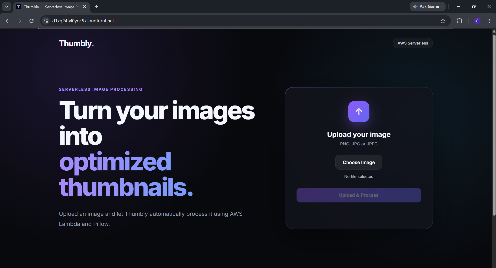
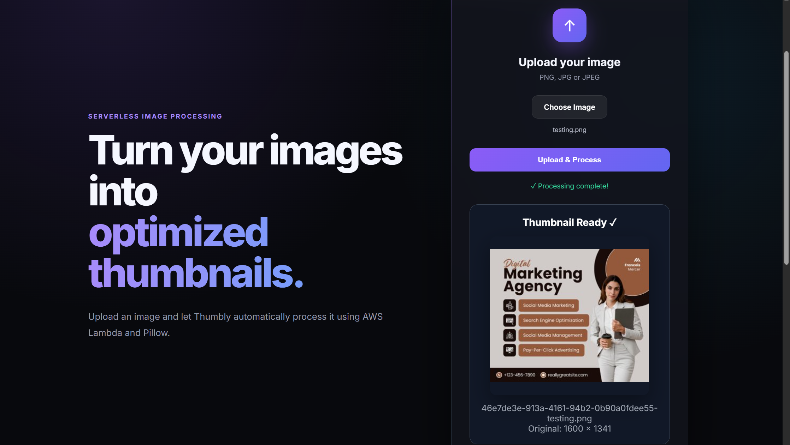
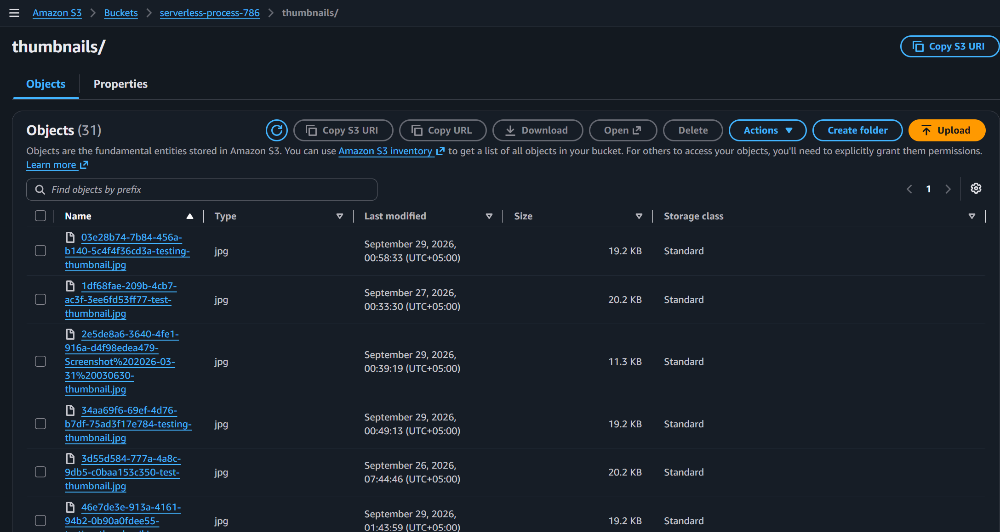
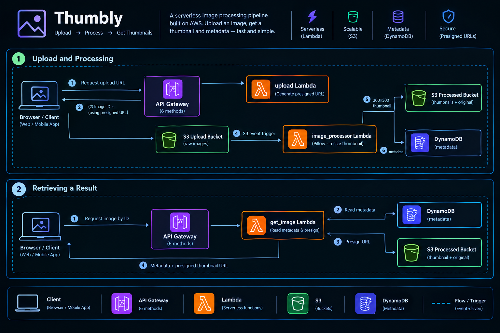
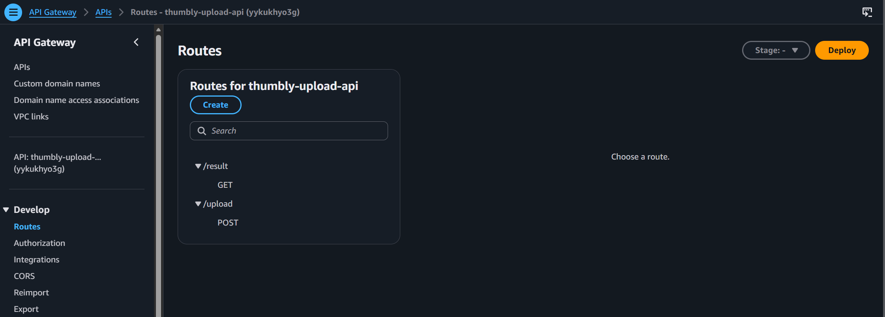
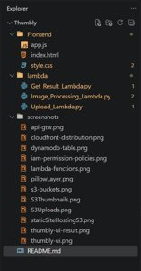

# Thumbly

**A serverless image processing pipeline built on AWS.**
Upload an image and Thumbly automatically generates an optimized 300×300 thumbnail. There are no servers to manage: uploads go straight to S3, and an S3 event triggers the processing.

**Live demo:** The deployment is currently stopped to keep AWS costs down. The screenshots below show the running application.

---

## Screenshots

| Dashboard | Result | Processed Bucket |
|---|---|---|
|  |  |  |

More screenshots are available in the [screenshots](screenshots/) folder.

---

## Overview

Thumbly is the event-driven project in my AWS portfolio. It shows how a file upload can trigger backend processing with no servers and no polling: the browser uploads directly to S3, S3 triggers a Lambda function, and the result is stored and served back through short-lived presigned URLs.

**How it works**

1. The frontend asks the backend for a **presigned upload URL**.
2. The image is uploaded **directly to Amazon S3**, so it never passes through the API.
3. The upload **automatically triggers** the image processor Lambda function.
4. **Pillow** generates a 300×300 thumbnail while preserving the aspect ratio.
5. The thumbnail is saved to a separate **processed S3 bucket**.
6. Image **metadata is stored in DynamoDB**.
7. The frontend fetches the result and receives a **temporary presigned URL** for the thumbnail.

---

## Architecture

The frontend is a static site hosted on S3 and delivered globally over HTTPS through CloudFront. The backend has two flows.

 

---

## AWS Services

| Service | Role |
|---|---|
| **Amazon S3** | Stores the original images, the processed thumbnails, and the frontend static files |
| **AWS Lambda** | Generates upload URLs, processes images, and serves image results |
| **Amazon API Gateway** | HTTP API endpoints for the frontend |
| **Amazon DynamoDB** | Stores image metadata |
| **Amazon CloudFront** | Delivers the frontend globally over HTTPS |
| **Amazon CloudWatch** | Lambda logs and monitoring |
| **Lambda Layer** | Packages the Pillow dependency for the processor function |

---

## Lambda Functions

| Function | Trigger | Responsibility |
|---|---|---|
| `upload` | API Gateway | Generates a unique image ID and a presigned S3 URL for a direct upload |
| `image_processor` | S3 upload event | Downloads the original, creates the thumbnail, saves it, and stores the metadata |
| `get_image` | API Gateway | Reads the metadata by image ID and returns a presigned thumbnail URL |

### Thumbnail processing

The original image is **never modified**. It stays in the upload bucket, and a separate thumbnail is generated:

1. Download the original image from the upload bucket
2. Open it with Pillow
3. Convert to RGB when required
4. Resize to fit a 300×300 canvas while **preserving the aspect ratio**
5. Save as an optimized JPEG
6. Upload it to the processed bucket
7. Store the metadata in DynamoDB

---

## API Endpoints

| Method | Route | Lambda | Description |
|---|---|---|---|
| `POST` | `/upload` | `upload` | Returns an image ID and a presigned upload URL |
| `GET` | `/image/{id}` | `get_image` | Returns the metadata and a presigned thumbnail URL |

 

---

## Design Notes

- **Direct-to-S3 uploads.** Presigned URLs let the browser upload straight to S3, so image data never goes through API Gateway or Lambda.
- **Separate buckets.** Originals and thumbnails live in different buckets, so a processed thumbnail can never re-trigger the processing function.
- **Temporary access.** Buckets stay private, and thumbnails are shared only through short-lived presigned URLs.
- **Configuration through environment variables.** Bucket and table names are never hardcoded in the functions.

---

## Security

- The frontend needs **no AWS credentials**
- Uploads use **temporary presigned S3 URLs** generated by the backend
- Thumbnails are served through **temporary presigned URLs**
- S3 **CORS** is configured for the deployed frontend
- No credentials or secrets are committed to the repository

---

## Project Structure

 

---

## Getting Started

### Prerequisites

- An AWS account
- AWS CLI configured (`aws configure`)
- Python 3.x (matching your Lambda runtime)

### Deployment

**Backend**

1. Create the **upload bucket** and the **processed bucket** in S3.
2. Create the **DynamoDB** table for the image metadata.
3. Build a **Lambda Layer** containing Pillow.
4. Create the three Lambda functions and attach the Pillow layer to `image_processor`.
5. Add an **S3 event notification** on the upload bucket that triggers `image_processor`.
6. Create the **API Gateway** endpoints and connect them to `upload` and `get_image`.
7. Configure **CORS** on the buckets for the frontend origin.

**Frontend**

1. Set the API Gateway URL in `frontend/app.js`.
2. Upload the frontend files to the hosting S3 bucket.
3. Serve the bucket through **CloudFront**.

### Environment Variables

| Variable | Description |
|---|---|
| `UPLOAD_BUCKET` | Bucket that receives the original images |
| `PROCESSED_BUCKET` | Bucket that stores the generated thumbnails |
| `TABLE_NAME` | DynamoDB table for the image metadata |

### Local Development

Serve the frontend locally with any development server (for example the VS Code **Live Server** extension). The local frontend talks to the deployed API Gateway backend.

---

## Features

- Direct-to-S3 uploads through presigned URLs
- Automatic, event-driven thumbnail generation
- Aspect-ratio-preserving 300×300 thumbnails saved as optimized JPEGs
- Image metadata stored in DynamoDB
- Secure, temporary access to processed images
- Global HTTPS delivery through CloudFront

---

## Roadmap

- [ ] Custom domain and HTTPS with Route 53
- [ ] Multiple thumbnail sizes and design options
- [ ] Additional image format optimization
- [ ] Authentication and user accounts
- [ ] Image history and gallery
- [ ] Infrastructure as code (AWS CDK or Terraform)
- [ ] CI/CD pipeline with GitHub Actions

---

## Tech Stack

**Frontend:** HTML, CSS, JavaScript
**Backend:** Python, Pillow
**Cloud:** AWS S3, Lambda, API Gateway, DynamoDB, CloudFront, CloudWatch

---

## Related Projects

More projects from my AWS portfolio:

1. **Task Manager:** Django app on EC2, ALB, Auto Scaling, and RDS (traditional server-based architecture)
2. **Docket:** serverless document management with API Gateway, Lambda, and DynamoDB
4. **Thumbly** (this project): serverless image processing pipeline with S3 events, Lambda, and Pillow

---

## Author

**Muhammad Sameer Khan**
BS Cloud Computing & Information Science, SSUET, Karachi

[GitHub](https://github.com/sameerkhanio) | [Linkedin](https://www.linkedin.com/in/sameerkhanio)
